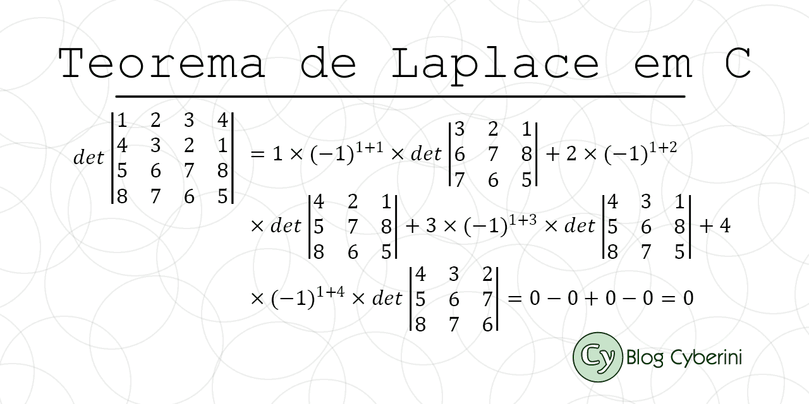

# TrabalhoAlgebra

## Calculo de determinante da matriz

    foi usado o teorema de laplace para matrizez 4x4
    para os calculos das outras determinantes foi usado regra de Sarrus
    funcionando ok
## Calculo da matriz inversa da matriz
    Foi usado o calculo com as matrizes adjuntas e matrizes transpostas e as determinantes
    A^-1 = Adj(A^t / det|A|)
    com A^-1 sendo a inversa e A^t a matriz transposta
    
## Calculo da matriz mudança de base
    pegamos as bases e montamos um sistema linear
    usamos a biblioteca numpy para calcular o sistema linear
    
